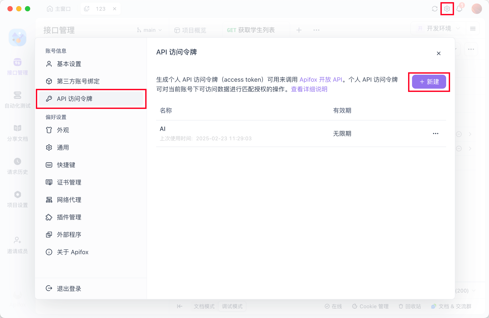
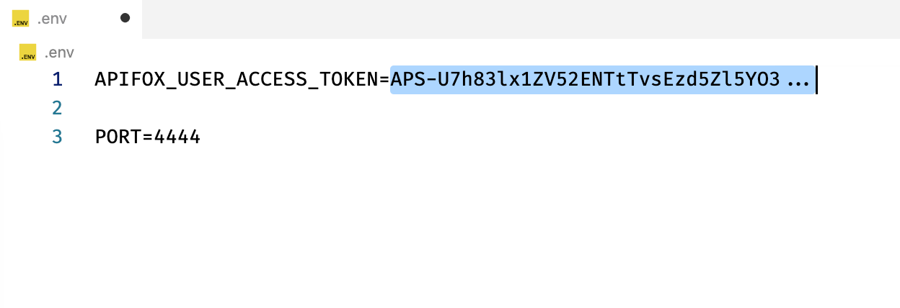
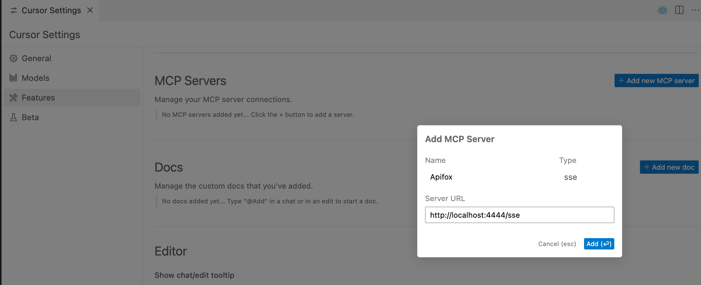
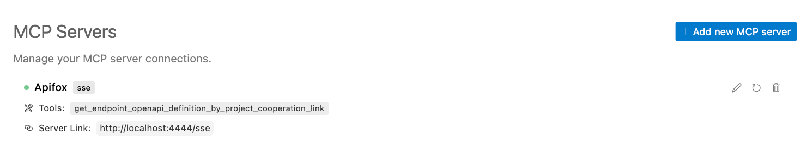
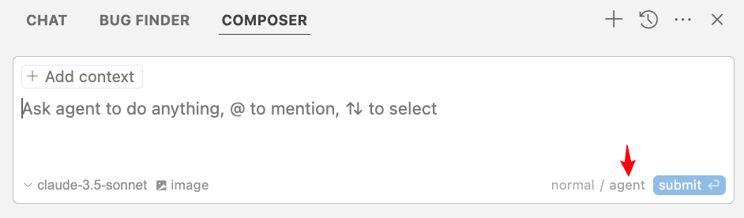
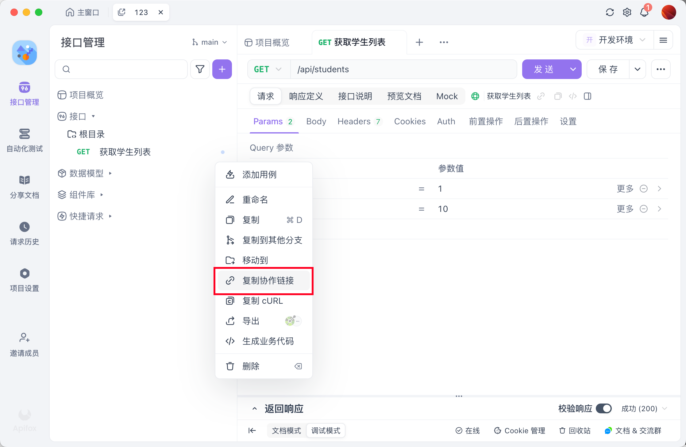
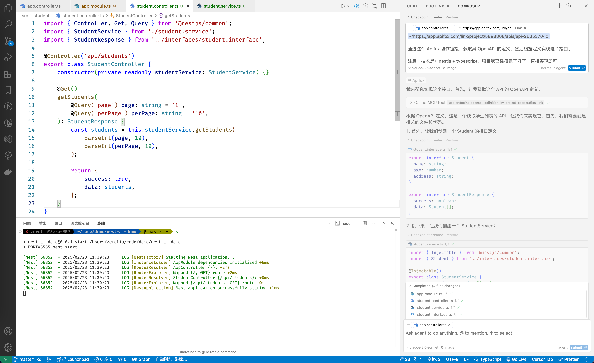
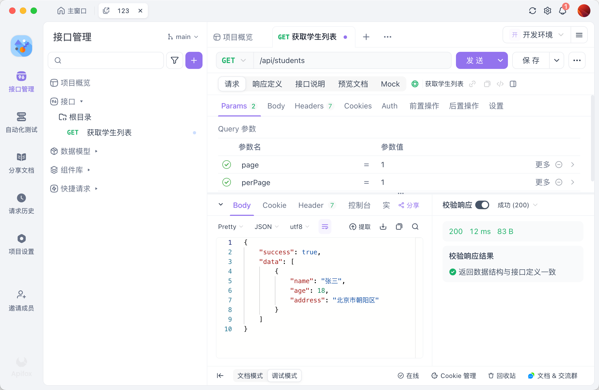
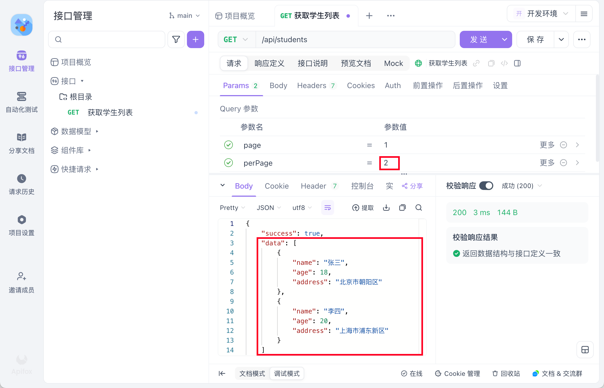

## 环境要求

- NodeJS >= 18

## 1. 准备 Apifox MCP 服务

### 1.1 克隆 Apifox MCP 项目

```shell
git clone https://github.com/Tzott/apifox-mcp-demo.git
```

### 1.2 创建环境变量

```shell
cd apifox-mcp-demo
cp .env.example .env
```

### 1.3 在 Apifox 客户端中创建一个Access Token ，并写入到 .env 文件中





### 1.4 启动 Apifox MCP 服务

```shell
# 如果没有安装 pnpm，可先运行：npm i -g pnpm

pnpm i && pnpm build && pnpm start
```

### 1.5 看到启动成功日志

```shell
> apifox-mcp-demo@0.0.1 start /Users/code/apifox-mcp-demo
> node lib/index.js

SSE endpoint: http://localhost:4444/sse
Message endpoint: http://localhost:4444/messages
HTTP server listening on port 4444
```

### 1.6 使用 Docker 部署（可选）

#### 1.6.1 使用 Docker 构建和运行

```shell
# 构建 Docker 镜像
docker build -t apifox-mcp-demo .

# 运行容器（默认端口 4444）
docker run -p 4444:4444 -e APIFOX_USER_ACCESS_TOKEN=你的访问令牌 apifox-mcp-demo

# 自定义端口（例如使用 8090 端口）
docker run -p 8090:8090 -e PORT=8090 -e APIFOX_USER_ACCESS_TOKEN=你的访问令牌 apifox-mcp-demo
```

#### 1.6.2 使用 Docker Compose 部署

##### 方法一：通过 .env 文件配置

在 .env 文件中设置环境变量：

```
PORT=8090  # 自定义端口，默认为 4444
APIFOX_USER_ACCESS_TOKEN=你的访问令牌
```

然后启动服务：

```shell
# 启动服务
docker-compose up -d

# 查看日志
docker-compose logs -f
```

##### 方法二：通过命令行设置环境变量

```shell
# 使用自定义端口启动服务
PORT=8090 docker-compose up -d

# 查看日志
docker-compose logs -f
```

#### 1.6.3 安全注意事项

为了安全起见，请注意以下几点：

1. **不要在 Dockerfile 中硬编码敏感信息**：访问令牌等敏感信息应该始终通过环境变量在运行时传入。

2. **使用安全的方式管理敏感信息**：
   - 在开发环境中使用 .env 文件（确保 .gitignore 中包含 .env）
   - 在生产环境中使用环境变量、Docker secrets 或专门的密钥管理服务

3. **不要将包含敏感信息的镜像推送到公共仓库**

4. **定期轮换访问令牌**：定期更新 Apifox 访问令牌以提高安全性

## 2. 准备 Cursor

### 2.1 创建一个空白的 Nestjs 项目

```shell
npm i -g @nestjs/cli
nest new nest-ai-demo
cd nest-ai-demo
```

### 2.2 添加一个 Cursor MCP 配置

从 `apifox-mcp-demo` 项目中复制 `sse 的地址`，填到 `Server URL` 中。



可以看到MCP 服务连接成功



### 2.3 打开 Cursor Composer，并切换到 Agent 模式



### 2.4 复制一个 Apifox 接口的协作链接



### 2.5 粘贴到 Composer 中，并让其实现接口

```plaintext
https://app.apifox.com/link/project/5898808/apis/api-263537040

通过这个 Apifox 协作链接，获取其 OpenAPI 的定义，然后根据定义实现这个接口。

注意：技术是：nestjs + typescript，项目我已经搭建了好了，直接实现即可。
```

### 2.6 Cursor Composer 实现完毕，并 Accepted 结果



### 2.7 启动 Nestjs服务，通过 Apifox 调用AI 写的接口，断言通过



## 3. 其他

分页也简单实现了

